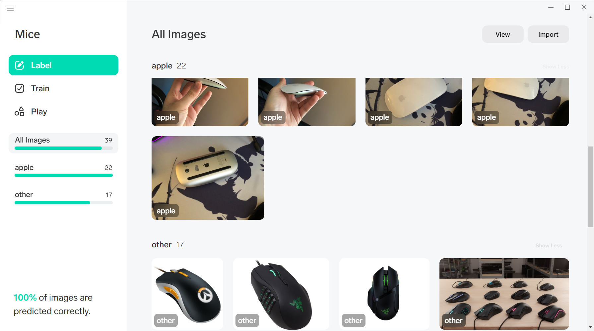

apple-mice-classifier
---

The classifier can distiguish if an image coresponds to a **white Apple Magic Mouse 2 mouse** or not.

If the input image is a "white Apple Magic Mouse 2 mouse" the classifier will predict its category as "apple", and if it is another mouse, "other".

**Note:** this project was made thanks to [Lobe.ai](https://lobe.ai/) and this is just a simple half hour project.

Usage
-----

The trained model is a Tensorflow model that you can use with Python 3.6 and Tensorflow (1.15.3).

You can try the model using the example from the "example" folder.
**Instructions [here](example/README.md)**

**Requirements**: Python 3.6.X ( https://www.python.org/downloads/release/python-368/ )

If installing on windows, download the "Windows x86-64 executable installer" (72f37686b7ab240ef70fdb931bdf3cb5), when installing make sure to tick the checkbox that adds your the Python executable files to the path.

Screenshot of Lobe:
----

